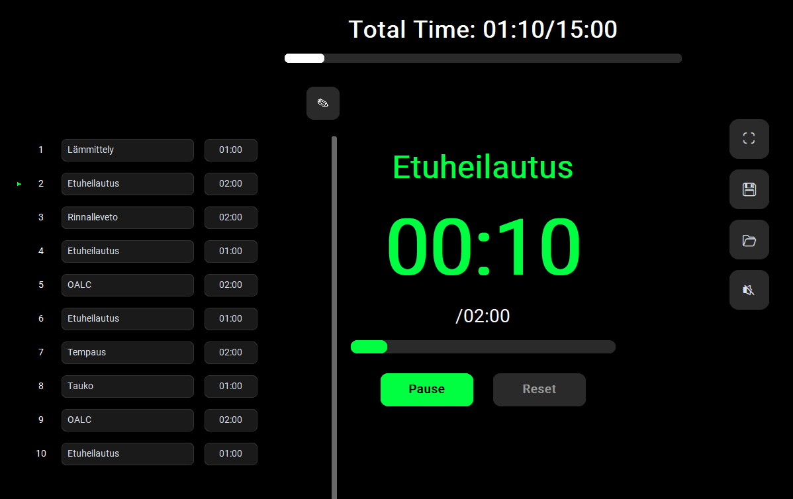

# Training Timer

A simple workout interval timer for managing multi-phase training sessions.

Warning: This project is completely vibe coded using Claude Code and GitHub Copilot and may have bugs. Use at your own risk.

## Screenshot



## Features

- Multiple workout phases with names and durations
- Start, pause, reset, and phase-jump controls
- Save and load workout routines as JSON files (see sample_exercise.json)
- Persistent sound setting and last used program
- Fullscreen mode and editable phase list

## Requirements

- Python 3.8+
- customtkinter

## Setup

```bash
pip install customtkinter
python main.py
```

## Usage

1. Choose how many phases you want to generate.
2. Edit the phase names and times in MM:SS format.
3. Start the timer with the Start button or Space key.
4. Reset with Reset or R.
5. Save or load routines from JSON files.
6. Use F11 to toggle fullscreen.

## Project structure

```text
training-timer/
├── main.py                     # Application entry point
├── timer_model.py              # Timer state and elapsed-time logic
├── timer_view.py               # UI widgets and display updates
├── timer_controller.py         # Connects model, view, and user actions
├── phase_manager.py            # Saves/loads workout phases and default phase data
├── settings_manager.py         # Persists settings such as sound state and last program path
├── test_timer.py               # Unit tests for timer, phase, and view behavior
├── settings.json               # User settings file created at runtime
├── sample_exercise.json        # Sample workout routine file
├── screenshot.png              # UI screenshot shown in this README
└── *.json                      # Saved workout routines and exported program files
```

## Tests

```bash
python -m unittest -q
```

## Notes

- Workout routines are stored as JSON objects with `name` and `time` fields (see sample_exercise.json).
- Settings are stored in `settings.json` and include the last loaded program and sound preference.
{
  "last_program_file": "path/to/your/workout.json",
  "sound_enabled": false
}
```

**Note**: The settings file is user-specific and excluded from version control via `.gitignore`.

## Known Limitations

- Audio notifications are Windows-specific (uses `winsound`)
- Phase durations must be in MM:SS format (no hours support)
- No pause between phase transitions

## Acknowledgments

- Implementatin made with Claude Code and GitHub Copilot!
- Built with [CustomTkinter](https://github.com/TomSchimansky/CustomTkinter) for modern UI components
- Icons and UI design inspired by modern fitness applications